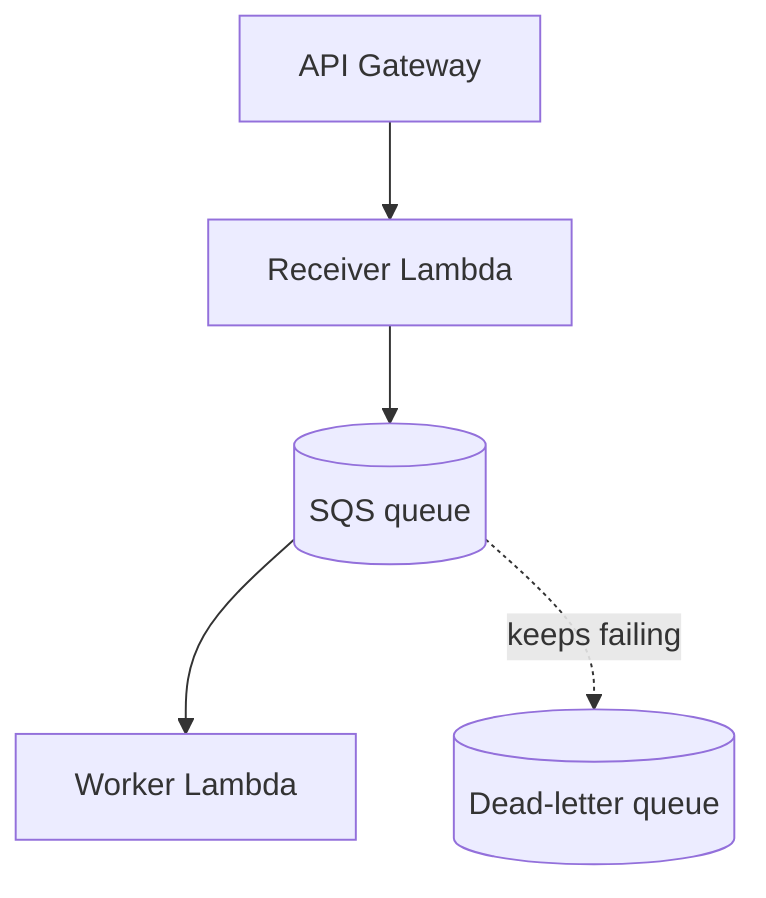
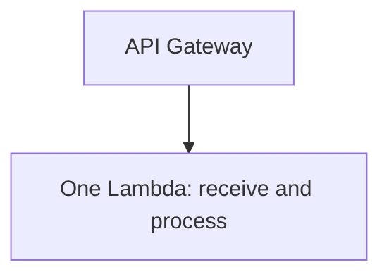
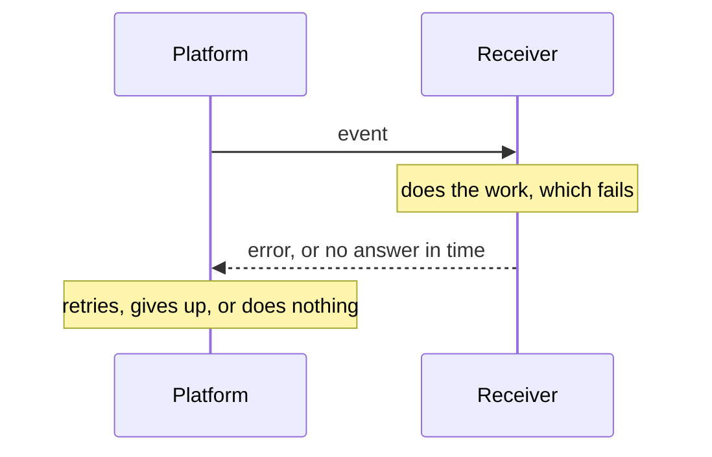
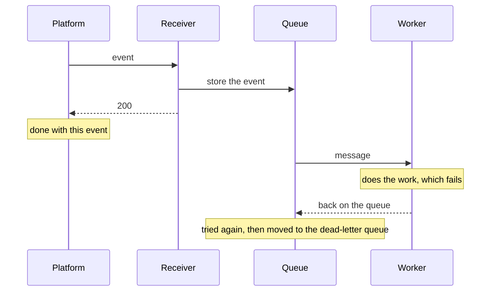
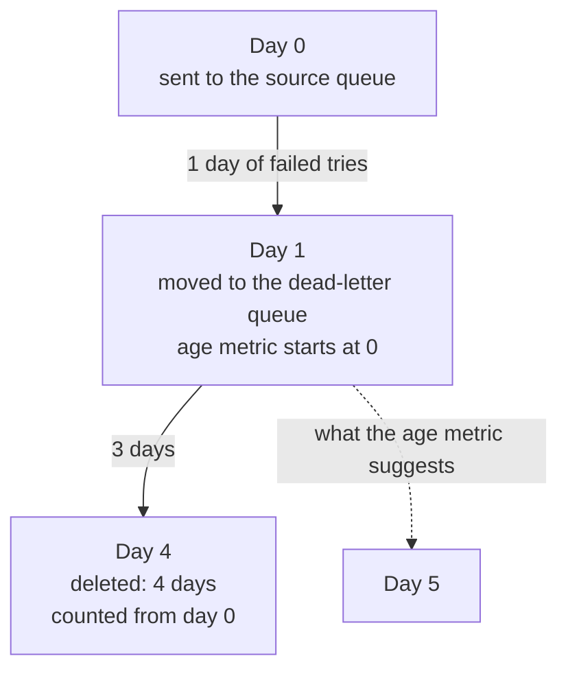

# Webhooks: sync or queue

The first webhook receiver I designed had five parts.

I worked it out with an AI assistant over many sessions: it proposed ways
to build it, and I chose among them until I had the design most guides
would give you. API Gateway takes the request. A small Lambda acknowledges
it and puts the event on an SQS queue. A second Lambda picks the event up
and does the work. Anything that keeps failing lands in a dead-letter
queue, where someone can look at it and send it back through once the
problem is fixed.

The design review cut it to two parts: API Gateway, and one Lambda that
receives the event and does the work inside the same request. The argument
was short. The job looked simple, this was enough for it, and if it ever
stopped being enough we could add the queue then.

So far, it hasn't stopped being enough. That receiver still runs as one
Lambda.

The design I brought wasn't wrong. It is close to what Stripe, Slack and
GitHub recommend in their own webhook docs, and for plenty of systems it is
the right one. But it answered a general question: how should a webhook
receiver work? The review answered a narrower one: how should this one
work, for this job? A suggestion, from a guide or an assistant, can only
answer the first. Another flow I work on has had a queue from the start,
and that one needs it.

So this post is about the narrower question. On a small middleware, sync is
a fair place to start, if you have weighed the trade-offs first: whether
the work fits the platform's timeout, whether the platform retries, what a
duplicate or a late event costs, and what will tell you it is time to
scale. Then watch for it, and add the queue when it says so.

It picks up where [Webhooks are not API calls](/notes/webhooks-are-not-api-calls/)
stopped. The request has arrived, the signature checks out, and you have
parsed what you use. The question now is whether to do the work before you
answer the platform, or after.

## Who says queue

Ask the platforms and you get the same advice, at different strengths.
[Stripe](https://docs.stripe.com/webhooks) is the most direct: "Configure your handler to process incoming
events with an asynchronous queue. You might encounter scalability issues
if you choose to process events synchronously." [Slack](https://docs.slack.dev/apis/events-api/) says to respond "as
soon as you can" and "Implement a queue to handle inbound events after
they are received." [GitHub](https://docs.github.com/en/webhooks/using-webhooks/best-practices-for-using-webhooks) says "you may want to set up a queue to process
webhook payloads asynchronously."

Read together, they agree on what a queue buys:

- **You answer in time.** You acknowledge once the event is safely stored,
  so the platform gets its response inside its timeout however long the
  work takes.
- **Spikes wait their turn.** Stripe's example is the start of the month,
  "when all subscriptions renew". Queued events are processed "at a rate
  your system can support" instead of all at once.
- **Failures are kept.** An event whose processing fails stays in the
  queue or a dead-letter queue until you fix the cause and send it through
  again, as long as the queue keeps it.

That is a real case. But read the wording again. GitHub says "may".
[Shopify](https://shopify.dev/docs/apps/build/webhooks/verify-deliveries) calls queuing "a useful
pattern for handling bursts of traffic and for ensuring you respond within
five seconds". [SHOPLINE's Open API](https://open-api.docs.shoplineapp.com/docs/create-webhook) suggests a queue only when there are
many events. [AWS's guide to choosing a serverless service](https://docs.aws.amazon.com/decision-guides/latest/decision-guides/choosing-aws-serverless-service.html) lists webhooks
among workloads that "don't require an immediate response and benefit from
queues". [LINE](https://developers.line.biz/en/docs/messaging-api/receiving-messages/) recommends processing "asynchronously" and names no
mechanism. Some platforms' webhook pages don't mention it.

And AWS's own [tutorial for receiving a webhook in Lambda](https://docs.aws.amazon.com/lambda/latest/dg/urls-webhook-tutorial.html) has no queue
at all: one function checks the signature and does the work. "Function
URLs are a good choice for simple webhooks," it says.

So even the strongest advice is conditional: when the work is slow, when
traffic spikes, when you can't answer in time. Whether those hold is a
question about your system, and the rest of this post takes it one
trade-off at a time.

## The work has to fit the platform's timeout

The first question is arithmetic. If you do the work inside the request,
the platform waits for all of it, and every platform stops waiting at some
point:

| Platform | How long it waits |
|---|---|
| [LINE](https://developers.line.biz/en/docs/messaging-api/check-webhook-error-statistics/) | 2 seconds |
| [Slack](https://docs.slack.dev/apis/events-api/) | 3 seconds |
| [Shopify](https://shopify.dev/docs/apps/build/webhooks/verify-deliveries) | 1 second to connect, 5 for the whole request |
| [SHOPLINE](https://developer.shopline.com/docs/apps/api-instructions-for-use/webhooks/overview) | 5 seconds (its separate [Open API](https://shopline-developers.readme.io/docs/circuit-breaker): 3 for app webhooks, 15 for merchant webhooks) |
| [GitHub](https://docs.github.com/en/webhooks/using-webhooks/best-practices-for-using-webhooks) | 10 seconds |
| Stripe, Meta, CYBERBIZ | not stated |

Mostly two to ten seconds, for the whole request: verifying the
signature, parsing, and every call the work makes downstream.

AWS is not what limits you. A Lambda function can run for [up to 15
minutes](https://docs.aws.amazon.com/lambda/latest/dg/configuration-timeout.html), and API Gateway waits [29 seconds by default](https://docs.aws.amazon.com/apigateway/latest/developerguide/api-gateway-execution-service-limits-table.html) for a REST API, [30](https://docs.aws.amazon.com/apigateway/latest/developerguide/http-api-quotas.html) for an
HTTP API. The platform's clock runs out long before either, and nothing
lines them up for you: a Lambda left at its default timeout of 3 seconds
can keep working on a LINE event for a second after LINE has stopped
listening.

So the question at design time is how much work one event triggers. The
sync receivers in this post do one write per event: an upsert into a
system downstream. The queued flow makes six to eight API calls per event
before it writes anything back. That is not work to bet a five-second
budget on. Neither answer needed a load test. Both were knowable from the
design.

Leave room, because the platform's clock covers the connection, any cold
start and your code. Lambda's own `Duration` metric counts only your
code: it "[does not include cold start time](https://docs.aws.amazon.com/lambda/latest/dg/monitoring-metrics-types.html)". A receiver that looks comfortable in
your dashboard can still be late at the platform's end.

And running out of time doesn't mean nothing happened. LINE's error
statistics count a `request_timeout` when "the bot server didn't return a
response within 2 seconds", and add: "Note that the webhook may have been
successfully received by the bot server." The work may have finished. The
platform recorded a failure anyway, and what it does next depends on
whether it retries.

## Who retries when it fails

The two designs put the retry in different hands.

Do the work inside the request, and you acknowledge only when it is done.
If it fails, you return an error or run out of time, and the platform
decides what happens next. Acknowledge first and queue the work, and the
platform's job ends at your `200`. From then on, every retry is yours.

So the second question is what the platform does with a failure. The
answers range from nothing to a week:

- **Never.** [GitHub](https://docs.github.com/en/webhooks/testing-and-troubleshooting-webhooks/redelivering-webhooks) "does not automatically redeliver failed
  deliveries"; you can redeliver by hand for three days. [LINE](https://developers.line.biz/en/docs/messaging-api/receiving-messages/) has
  redelivery, but "By default, webhook redelivery is disabled", and when
  you turn it on, the number and interval "aren't disclosed".
- **Minutes.** [Slack](https://docs.slack.dev/apis/events-api/) retries three times: almost immediately, after
  one minute, and after five.
- **Hours to days.** [Shopify](https://shopify.dev/docs/apps/build/webhooks/verify-deliveries) retries "8 times over the next 4 hours",
  [SHOPLINE](https://developer.shopline.com/docs/apps/api-instructions-for-use/webhooks/overview) up to 19 times "within 48 hours", [Stripe](https://docs.stripe.com/webhooks) "for up to
  three days", and Meta for [36 hours](https://developers.facebook.com/docs/graph-api/webhooks/getting-started) or [7 days](https://developers.facebook.com/documentation/business-messaging/whatsapp/webhooks/overview), depending on which of
  its pages you read.

If the platform never retries, a failure inside the request is a lost
event. That is why the queued flow needs its queue: its platform doesn't
retry at all, so the queue is the only second chance an event gets.

The platforms that do retry have a sharper edge. Retries are meant for a
blip. A receiver that keeps failing, because the work is slow or a
dependency is down, runs into what the platform does about a bad endpoint.
After eight consecutive failures, Shopify deletes a subscription made
through its Admin API and emails you. After its last retry, if nothing of
that event type got through in the meantime, SHOPLINE cancels the
subscription and sends an email titled "Webhook Event Subscription
Deleted". Slack temporarily disables event subscriptions for an app whose
deliveries fail more than 95% of the time over an hour, unless it gets
fewer than 1,000 events an hour. A struggling sync receiver can lose every
later event, not just the failed ones, until someone reads the email.

And some platforms don't say. CYBERBIZ's partner guide says nothing about
timeouts or retries, so a delivery that fails inside the request may
simply be gone.

Either way, find out whether your platform retries, for how long, and what
it does at the end, before you choose. If the docs don't say, design as if
it doesn't. And keep a way to catch up:
[Shopify](https://shopify.dev/docs/apps/build/webhooks) and SHOPLINE both
recommend reading their APIs for anything the webhooks missed, the same
slow reconciliation poll from [Webhooks are not API
calls](/notes/webhooks-are-not-api-calls/).

The queue doesn't make retries go away. It makes them yours: how many
times a message is tried, how long it waits between tries, and where it
goes when it runs out. Acknowledge only once the queue has accepted the
event, or a failed write to the queue loses it just as surely.

## Duplicates, and late events

Whichever design you pick, you will get some events twice. The platforms
say so: [Shopify](https://shopify.dev/docs/apps/build/webhooks/verify-deliveries) ("your app might receive the same webhook more than
once"), [Stripe](https://docs.stripe.com/webhooks), [LINE](https://developers.line.biz/en/docs/messaging-api/receiving-messages/), [SHOPLINE](https://developer.shopline.com/docs/apps/api-instructions-for-use/webhooks/overview), and Meta, whose retries "[can
result in duplicate webhook notifications](https://developers.facebook.com/documentation/business-messaging/whatsapp/webhooks/overview)". A queue doesn't remove
them. It adds its own: an SQS standard queue promises "[at-least-once
message delivery](https://docs.aws.amazon.com/AWSSimpleQueueService/latest/SQSDeveloperGuide/standard-queues.html)", and a Lambda reading from it will "[process each
event at least once](https://docs.aws.amazon.com/lambda/latest/dg/with-sqs.html)".

The textbook answer is to remember what you've handled. Stripe's version:
guard against duplicates "by logging the event IDs you've processed, and
then not processing already-logged events." Most platforms give you an ID
for it, often unchanged across retries, though not every platform
documents one. It is the same defence [Webhooks are not API calls](/notes/webhooks-are-not-api-calls/) pointed to against a
copied request: with no signed timestamp, remembering is all you have.

We don't remember anything. There is no cache or table to hold handled IDs,
and a Lambda doesn't live long enough to hold them itself. What makes that
safe is the write: the receivers in this post upsert into a system that
already ignores information it has, so the same event twice lands the same
state as once. A retry costs nothing. Neither does a copied request.

That only holds because the write is idempotent. If the work sends a
message to a buyer, or charges a card, a duplicate is a second message or a
second charge, and you need the store and the ID. So the question isn't "do
I deduplicate?" It is "what does my write do the second time?"

Late events are a different question, and the upsert doesn't answer it.
Nobody promises order. [Shopify](https://shopify.dev/docs/apps/build/webhooks) "doesn't guarantee ordering within a
topic", [GitHub](https://docs.github.com/en/webhooks/testing-and-troubleshooting-webhooks/troubleshooting-webhooks) "may deliver webhooks in a different order than the
order in which the events took place", Stripe says much the same, and an
SQS standard queue's messages "may occasionally arrive out of order".
If an older update arrives after a newer one, an upsert writes the older
data last. Shopify and GitHub say to reorder by the timestamps in the
delivery. Stripe says the opposite: "Don't use created to determine
event order", because distinct events can share a timestamp.

For our data, order doesn't matter: a late event can't overwrite anything
newer. That is a property of the data, worth checking at design time
rather than finding out. A FIFO queue is not the fix it sounds like.
It keeps events in the order your receiver got them, which is already the
platform's order, and AWS [warns](https://docs.aws.amazon.com/AWSSimpleQueueService/latest/SQSDeveloperGuide/sqs-dead-letter-queues.html) that a dead-letter queue breaks that
order anyway.

## What the queue costs

[Webhooks are not API calls](/notes/webhooks-are-not-api-calls/) ended on a queue bringing "trade-offs of its
own". Here they are: what the review in the opening was weighing.

**More parts, and settings that have to agree.** The reviewed design had
two parts. Mine had five: the gateway, a receiver, the queue, a worker and
a dead-letter queue, and it would also have needed an alarm on that queue
and someone who knows what to do when it fires. Whoever is on call has to
understand every one. And the settings depend on each other. AWS says to
set the queue's visibility timeout to "[at least six times the
configuration timeout on your
function](https://docs.aws.amazon.com/lambda/latest/dg/services-sqs-configure.html)",
to give a message "at least 5" receives before it moves to the dead-letter
queue, and to keep the dead-letter queue's retention longer than the source
queue's, for a reason the next section comes back to. One function that
does the work and answers has none of that.

**Someone has to own it.** Every part is one more thing to deploy, watch
and explain to whoever is on call next. A pipeline nobody has time to
watch is worse than a function everyone understands. The review wasn't
saying "never". It was saying "not yet", which only works if something
tells you when "yet" arrives.

**A stored copy of the buyer's data.** That post argued against keeping raw
requests, because an order event is a buyer's name, phone number and
address, and every copy is one more to protect and delete on time. A queue
is a copy. The event waits in it until it is processed, and in the
dead-letter queue until someone sends it back through or it expires.

What it does give you is deletion that nobody has to remember. SQS deletes
a message when its retention period runs out: "[By default, a message is
retained for 4 days](https://docs.aws.amazon.com/AWSSimpleQueueService/latest/SQSDeveloperGuide/quotas-messages.html)", configurable from one minute to fourteen days.
Encryption at rest is on by default for new queues, though AWS says the
default "[is only effective when you create a queue without specifying
encryption attributes](https://docs.aws.amazon.com/AWSSimpleQueueService/latest/SQSDeveloperGuide/sqs-configure-sqs-sse-queue.html)", and it [doesn't encrypt](https://docs.aws.amazon.com/AWSSimpleQueueService/latest/SQSDeveloperGuide/sqs-server-side-encryption.html) message attributes, so
keep buyer data out of them.

That retention period does two jobs. It is how long buyer data can sit at
rest, so shorter is better. It is also how long you have to notice a
failure and send the event back through, so longer is safer. One setting,
pulled two ways, chosen before you know which you'll need.

## When the queue was right

The queued flow makes the opposite case. Each event triggers six to eight
API calls before anything is written back, and its platform never retries.
The receiver puts the event on a queue and returns `200` at once. A worker
takes messages one at a time. A message that fails too many times moves to
a dead-letter queue, and an alarm posts to Slack when that queue passes a
threshold.

Then traffic spiked, and the system downstream got stuck. The worker's
calls failed, each message was retried until it ran out of receives, and
the dead-letter queue filled. The alarm fired once. We waited for the
downstream system to recover and sent the messages back through by hand,
within a day of the alert. Nothing was lost.

Done inside the request, those events would have failed too, and a
platform that never retries would never have sent them again. The queue
was the only reason we still had them, and its alarm was how we found out.

**Not every alert means the same thing.** Ours was a shared dependency:
everything failed for one reason, and sending everything back through
worked once that reason was gone. The other kind is one message that fails
every time, a poison pill: send it back through and it fails again. Working
one message at a time keeps it from taking others down with it. With
batches, by default "[all messages in that batch return to the
queue](https://docs.aws.amazon.com/lambda/latest/dg/services-sqs-configure.html)"
when one fails, unless the function reports which ones failed. Poison pills
also hide: AWS's age metric for a queue
[skips](https://docs.aws.amazon.com/AWSSimpleQueueService/latest/SQSDeveloperGuide/sqs-available-cloudwatch-metrics.html)
any message received three or more times without being deleted. Before you
redrive, look at what is in the queue and ask which kind you have.

**The clock is older than it looks.** Our dead-letter queue keeps messages
for about a week, so a day's delay was comfortably inside it. But on a
standard queue, "[the expiration of a message is always based on its
original enqueue timestamp](https://docs.aws.amazon.com/AWSSimpleQueueService/latest/SQSDeveloperGuide/sqs-dead-letter-queues.html)". AWS's own example: a message spends a day in
the source queue, the dead-letter queue keeps messages for four days, and
the message is deleted three days after it arrives. Meanwhile the
dead-letter queue's age metric restarts when the message moves, so an
alarm on message age makes it look younger than it is. Hence the advice to
keep the dead-letter queue's retention longer than the source queue's.
Redrive starts the clock again: AWS treats redriven messages as [new
messages](https://docs.aws.amazon.com/AWSSimpleQueueService/latest/SQSDeveloperGuide/sqs-configure-dead-letter-queue-redrive.html), with a new ID and a new enqueue time.

None of this is automatic. Someone has to see the alert, work out which
kind of failure it is, wait for the cause to clear, and start the redrive
before the clock runs out. The queue kept the events. People still had to
bring them back.

## Knowing when to scale

"Scale when it's needed" is only a plan if something tells you when. Here
is what I would watch.

**On a sync receiver,** the number that matters is how long the function
takes against the platform's timeout. Lambda reports it as `Duration`;
look at the slow end, not the average, and remember it leaves out cold
starts. When the slowest requests creep toward the platform's limit, the
work has stopped fitting, and that is the queue's cue. `Errors` counts
timeouts too, so a rise under load says the same thing more loudly.
`Throttles` means Lambda turned requests away because it ran out of
concurrency, which the platform sees as a failure.

**On the platform's side,** some of the signal is already there. LINE
keeps [webhook error statistics](https://developers.line.biz/en/docs/messaging-api/check-webhook-error-statistics/), timeouts included. Shopify sends
warning emails to the app's emergency developer address, SHOPLINE emails
you when it cancels a subscription, and Slack when it disables one.
Those emails are monitoring nobody had to build. They only work if they
reach someone who reads them.

**On a queued flow,** watch the dead-letter queue. AWS suggests an alarm
on [the number of messages in it](https://docs.aws.amazon.com/AWSSimpleQueueService/latest/SQSDeveloperGuide/dead-letter-queues-alarms-cloudwatch.html), which is what told us about the
incident. Treat its age metric with the caution from the last section.

Without signals of your own, you hear about trouble from the platform,
through an error statistic or an email, later than an alarm would have told
you. Watching is the part of "sync first" that is easiest to skip, because
nothing breaks the day you skip it.

## Where the design starts

The receiver from the opening still runs as one Lambda. The flow built
around a queue needed that queue the day traffic spiked. I think both are
right where they are. The difference was never which design is better. It
was the answers to a few questions:

- **Does the work fit the platform's timeout,** with room for a cold start?
  One upsert does. Six to eight API calls are not a bet I'd make.
- **Does the platform retry, and what does it do at the end?** If it never
  retries, a failure inside the request is a lost event. If it gives up on
  you, it may take the subscription with it.
- **What does your write do the second time, or late?** An idempotent
  upsert shrugs off a duplicate. A message or a charge doesn't. And a late
  event is a separate question from a duplicate one.
- **What will tell you it's time?** Something has to, or "scale when
  needed" never arrives.

The recommended design, from a platform's docs or from an assistant, is a
good place to start, because it lists what can go wrong. The design is
deciding which of those you need to pay for now.

What I'd like to write about next is what happens after the work: when
processing one webhook writes to another system that sends webhooks of its
own, and the two start answering each other.
